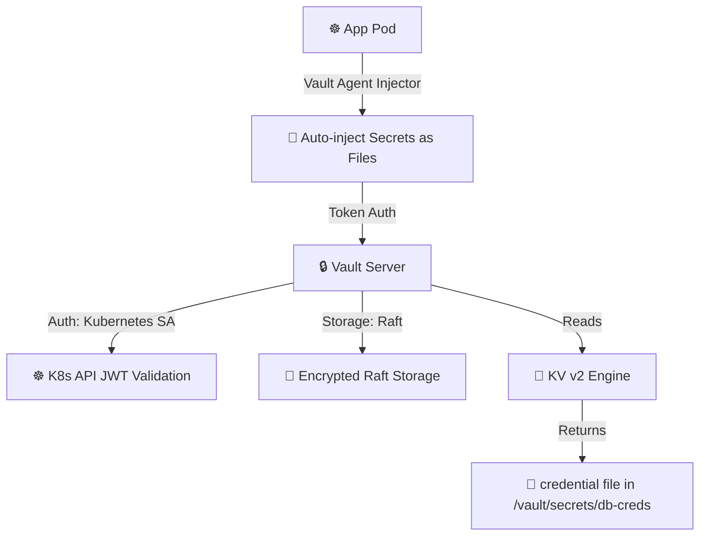

# 🔒 Vault Secrets Studio
> **Configure dynamic secrets engines and PKI certificate authorities. Manage dynamic credentials databases roles, and simulate automated lease TTL countdowns.**

[](https://pradeeptalari14.github.io/portfolio/tools/vault-secrets/)
[]()

---

## 🎛️ Studio Options — What the UI Generates

The studio has multiple configurable options. Each combination produces different output files.
This repository contains **one working example per option variant** so you can learn by diffing.

### Output Tabs (files the studio generates)
| Tab | Description |
|-----|-------------|
| `config.hcl` | Generated in studio Output tab |
| `app-policy.hcl` | Generated in studio Output tab |
| `kubernetes-injector.yaml` | Generated in studio Output tab |
| `vault-init.sh` | Generated in studio Output tab |
| `Flow Diagram` | Generated in studio Output tab |

### Configurable Options
| Option | Available Values |
|--------|-----------------|
| **Storage Backend** | `Raft (Integrated)` / `Consul` / `S3` |
| **Secret Engine** | `KV v2 (Versioning)` / `Transit (Encryption as a Service)` / `Dynamic Database` |

---

## 🏗️ Architecture Flow Diagram




---

## 📁 Repository Structure

```
tp-vault-secrets/
├── README.md          ← This file — complete learning guide
├── vault/config.hcl
├── vault/policies/app-policy.hcl
├── vault/kubernetes-injector.yaml
├── scripts/vault-init.sh
├── scripts/           ← Deployment + validation helpers
└── docs/USAGE.md      ← Extended usage guide
```

---

## ⚡ Quick Start

### Step 1 — Generate files from the Studio
1. Open **[Vault Secrets Studio Studio](https://pradeeptalari14.github.io/portfolio/tools/vault-secrets/)**
2. Select your option values in the UI
3. Watch the output update live in the editor
4. Click **Download** or **Copy** for each tab

### Step 2 — Use the example files in this repo
```bash
git clone https://github.com/Pradeeptalari14/tp-vault-secrets.git
cd tp-vault-secrets
# Browse examples/ to find the variant matching your needs
# Copy the relevant files into your project
```

---

## 🔄 Complete Start-to-End Workflow


---

## 📖 How Each Option Changes the Output

### Storage Backend
- **`Raft (Integrated)`** — see `examples/` folder for generated output
- **`Consul`** — see `examples/` folder for generated output
- **`S3`** — see `examples/` folder for generated output

### Secret Engine
- **`KV v2 (Versioning)`** — see `examples/` folder for generated output
- **`Transit (Encryption as a Service)`** — see `examples/` folder for generated output
- **`Dynamic Database`** — see `examples/` folder for generated output

---

## 💡 SRE Compliance & Best Practices

| SRE Compliance Pillar | ❌ Anti-Pattern | ✅ Production Best Practice |
|---|---|---|
| **Secrets Protection** | Committing passwords or dynamic tokens to repositories | Exclude sensitive files in `.gitignore` and reference Vault parameters |
| **Deployment Auditing** | Manual ad-hoc server updates | Enforce infrastructure validation and continuous deployment pipelines |

## 🔐 Security Standards

- ❌ Never commit credentials, API keys, or database passwords directly to Git repositories.
- ✅ Reference dynamic parameters using cloud Secret Managers (Vault, AWS SSM Parameter Store, Key Vault).
- ✅ Enforce branch protection rules: require peer pull request reviews and green status checks.

---

## 📖 Resources

| Resource | Link |
|----------|------|
| Interactive Studio | [Open →](https://pradeeptalari14.github.io/portfolio/tools/vault-secrets/) |
| All 91 Studios | [Dashboard →](https://pradeeptalari14.github.io/portfolio/tools/) |
| SRE Provisioning Guide | [Handbook →](https://github.com/Pradeeptalari14/portfolio/blob/main/GITHUB_PROVISIONING_GUIDE.md) |

---
*Generated by [Vault Secrets Studio Studio](https://pradeeptalari14.github.io/portfolio/tools/vault-secrets/) — [Talari Pradeep Portfolio](https://pradeeptalari14.github.io/portfolio)*